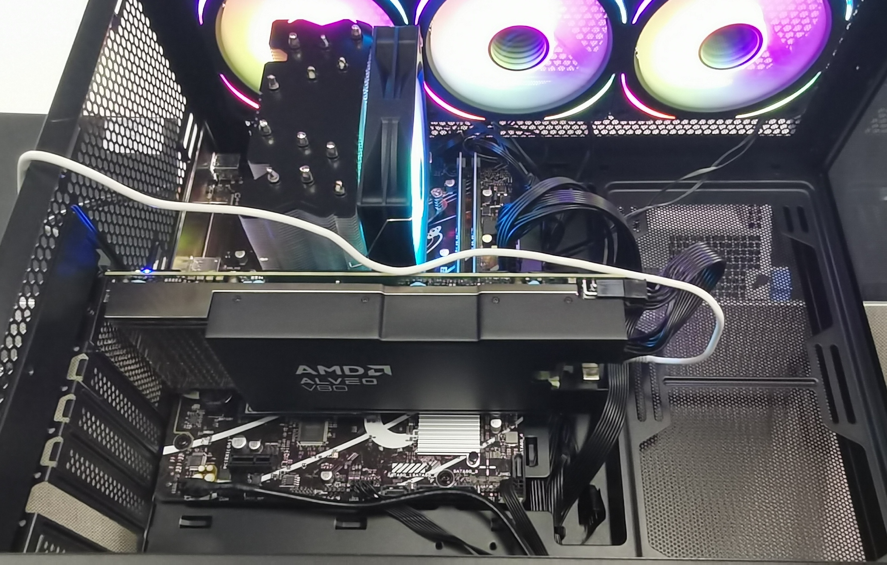

# DFVG: A Heterogeneous Architecture for Speculative Decoding with Draft-on-FPGA and Verify-on-GPU

**DFVG (Draft-on-FPGA, Verify-on-GPU)** is a heterogeneous computing architecture designed for **speculative decoding** in large language models.  
The key idea is to perform the **draft generation** stage on FPGAs for fast parallel candidate generation, and the **verification** stage on GPUs for efficient matrix computation. This design fully leverages the complementary strengths of both hardware platforms to achieve **low latency and high throughput** decoding.

---

## 📷 Architecture



---

## ✨ Features

- **FPGA Draft Generation**: Fast candidate sequence generation with parallel computation  
- **GPU Verification**: Efficient verification leveraging GPU’s strong matrix operations  
- **Heterogeneous Collaboration**: Exploits FPGA and GPU complementarity to reduce latency and energy cost  
- **Modular Design**: Flexible deployment and easy extension across hardware platforms  

---

## 📂 Project Structure

---

## 🚀 Getting Started

1. Clone the repository
   ```bash
   git clone https://github.com/your-username/DFVG.git
   cd DFVG

open README.md

make build
./run_dfvg

Guan Maochuang, DFVG: A Heterogeneous Architecture for Speculative Decoding with Draft-on-FPGA and Verify-on-GPU, 2025.

