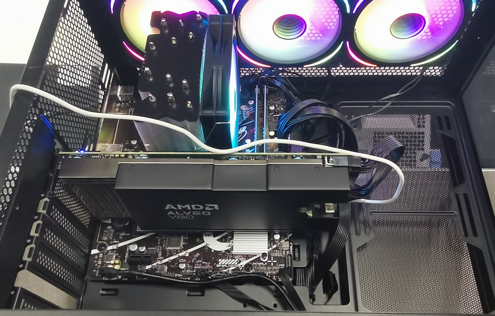
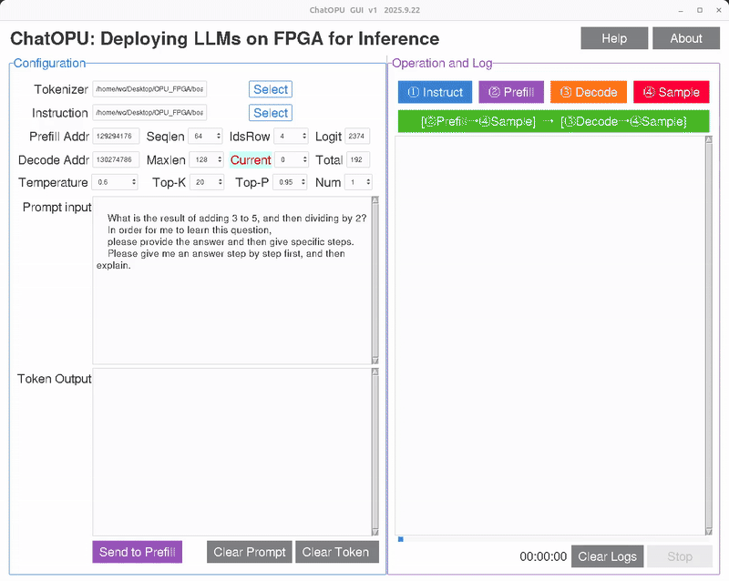

# DFVG: A Heterogeneous Architecture for Speculative Decoding with Draft-on-FPGA and Verify-on-GPU

**DFVG (Draft-on-FPGA, Verify-on-GPU)** is a heterogeneous computing architecture designed for **speculative decoding** in large language models.  
The key idea is to perform the **draft generation** stage on FPGAs for fast parallel candidate generation, and the **verification** stage on GPUs for efficient matrix computation. This design fully leverages the complementary strengths of both hardware platforms to achieve **low latency and high throughput** decoding.

---

## 📷 Architecture

---

## ✨ Features

- **FPGA Draft Generation**: Fast candidate sequence generation with parallel computation  
- **GPU Verification**: Efficient verification leveraging GPU’s strong matrix operations  
- **Heterogeneous Collaboration**: Exploits FPGA and GPU complementarity to reduce latency and energy cost  
- **Modular Design**: Flexible deployment and easy extension across hardware platforms  
---

## 📂 Project Structure
DFVG/
├── fpga/                 # FPGA design and bitstream build flow
├── gpu/                  # GPU kernels and related build files
├── configs/              # Experiment and model configuration files
├── scripts/              # Utility, model, dataset, and experiment scripts
├── results/              # (Generated) experiment outputs
└── README.md             # This file

---

## 🚀 Getting Started

1. Clone the repository
git clone https://anonymous.4open.science/r/DFVG-DE39
cd DFVG

2.Install Dependencies
sudo apt update
sudo apt install build-essential cmake
pip install -r requirements.txt

3.Setup FPGA Environment
source /opt/xilinx/xrt/setup.sh
export XILINX_VIVADO=/opt/Xilinx/Vivado/2024.1

4.Build FPGA Bitstream:
cd fpga/
make synthesize
make implement

5. Compile GPU Kernels:
cd gpu/
make all

6. Download Models:
python scripts/download_models.py

7. Example execution:
python scripts/run_experiments.py
--config configs/llama7b.yaml
python scripts/collect_results.py
--output results/

8.Expected Output Files:
• performance_summary.json: Overall speedup and
efficiency metrics
• energy_analysis.csv: Detailed energy consumption
breakdown
• ablation_results.json: Component-wise performance contributions
• resource_utilization.log: FPGA and GPU resource
usage

9.Configuration Parameters:
• Draft Length: Modify configs/draft_params.yaml
• Batch Size: Adjust BATCH_SIZE in configuration files
• Model Selection: Change TARGET_MODEL and DRAFT_MODEL
• Hardware Mapping: Modify device assignments in
device_config.yaml
(1)Adding New Models:
python scripts/add_model.py
--target new_model --draft new_draft
(2)Custom Datasets:
python scripts/prepare_dataset.py
--input custom_data.json

