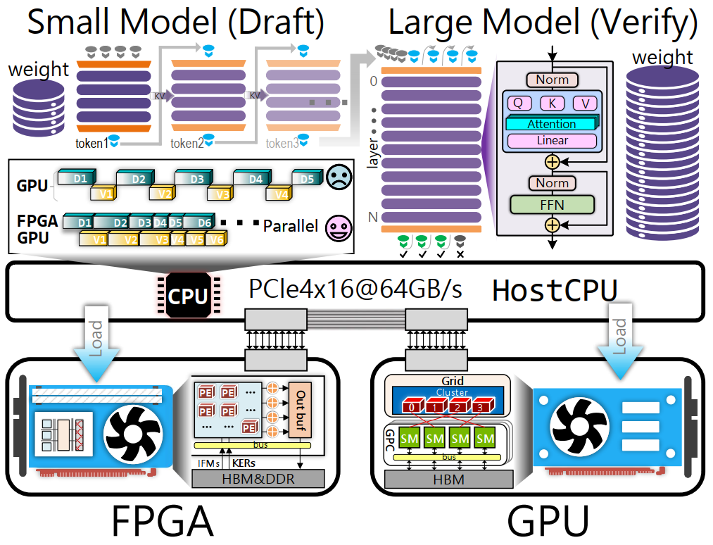
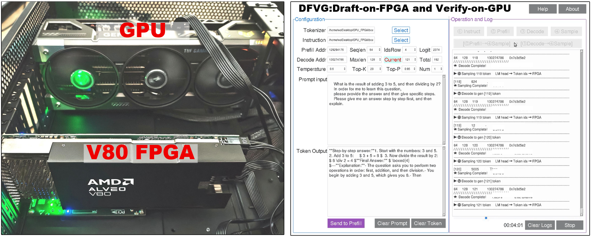
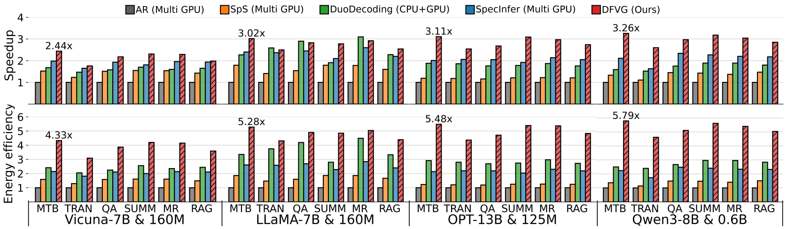
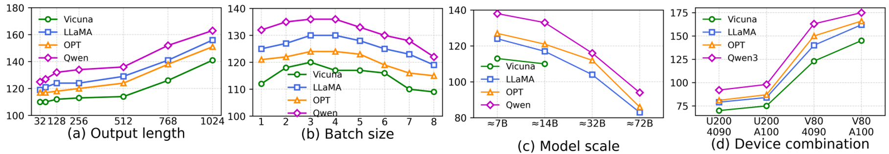

# DFVG: A Heterogeneous Architecture for Speculative Decoding with Draft-on-FPGA and Verify-on-GPU

Welcome to the official code repository for "[https://anonymous.4open.science/r/DFVG-DE39]".  

⭐⭐⭐Your star means a lot to us in developing this project! 

## 📰 News

- **2025-11-15**: Updated the codebase with new features and configurations.
- **2025-08-20**: Submitted the paper.

1
---

## ✨ Introduction
**DFVG (Draft-on-FPGA, Verify-on-GPU)** is a heterogeneous computing architecture designed for 
**speculative decoding** in large language models.  
The key idea is to perform the **draft generation** stage on FPGAs for fast parallel candidate generation, 
and the **verification** stage on GPUs for efficient matrix computation. This design fully leverages 
the complementary strengths of both hardware platforms to achieve **low latency and high throughput** decoding.

- **FPGA Draft Generation**: Fast candidate sequence generation with parallel computation  
- **GPU Verification**: Efficient verification leveraging GPU’s strong matrix operations  
- **Heterogeneous Collaboration**: Exploits FPGA and GPU complementarity to reduce latency and energy cost  
- **Modular Design**: Flexible deployment and easy extension across hardware platforms  

---

## 📷 Architecture

<p align="center">
  
</p>

<p align="center">
  
</p>


<p align="center">
  
</p>

<p align="center">
  
</p>


---

## 📂 Project Structure
```bash
DFVG/
├── fpga/                 # FPGA design and bitstream build flow
├── gpu/                  # GPU kernels and related build files
├── scripts/              # Utility, model, dataset, and experiment scripts
├── results/              # (Generated) experiment outputs
└── README.md             # This file
```
---

## 🚀 Getting Started

## 📥 1. Clone the Repository
```bash
git clone https://anonymous.4open.science/r/DFVG-DE39
cd DFVG
```

## 📦 2. Install Dependencies
Make sure you are using Python 3.10+.
```bash
sudo apt update
sudo apt install -y build-essential cmake
pip install -r requirements.txt
```

## ⚙️ 3. Set Up FPGA Environment
Before building the bitstream, configure the Xilinx environment:
```bash
source /opt/xilinx/xrt/setup.sh
export XILINX_VIVADO=/opt/Xilinx/Vivado/2024.1
```

## 🏗 4. Build the FPGA Bitstream
This generates the FPGA bitstream used for draft generation.
```bash
cd fpga/
make synthesize
make implement
```

## 🧩 5. Compile GPU Kernels
This compiles all GPU kernels required for verification stage.
```bash
cd gpu/
make all
```

## 📥 6. Download Required Models
This script fetches both target model and draft model used in DFVG.
```bash
python scripts/download_models.py
```

## ▶️ 7. Run Example Experiments
(1) Run experiments:
```bash
python scripts/run_experiments.py --config configs/llama7b.yaml
```
(2) Collect results:
```bash
python scripts/collect_results.py --output results/
```

## 📄 8. Expected Output Files
```bash
• performance_summary.json: Overall speedup and efficiency metrics
• energy_analysis.csv: Detailed energy consumption breakdown
• ablation_results.json: Component-wise performance contributions
• resource_utilization.log: FPGA and GPU resource usage
```

## 🔧 9. Configuration Parameters
```bash
• Draft Length: Modify configs/draft_params.yaml
• Batch Size: Adjust BATCH_SIZE in configuration files
• Model Selection: Change TARGET_MODEL and DRAFT_MODEL
• Hardware Mapping: Modify device assignments in device_config.yaml
```
## ➕ 10. Additional Tools
(1) Add a New Model
```bash
python scripts/add_model.py \
  --target new_model \
  --draft new_draft
```
(2) Prepare a Custom Dataset
```bash
python scripts/prepare_dataset.py
--input custom_data.json
```

---

## 📚 Citation

Please cite our work if you use our code or discuss our findings in your own research:

```bibtex
@article{dfvg2025specdecoding,
  title={DFVG: A Heterogeneous Architecture for Speculative Decoding with Draft-on-FPGA and Verify-on-GPU},
  author={xxx, xxx},
  journal={xxx, xxx},
  year={2025}
}
```

---

## 🔍 Related Work  
Explore related work on speculative decoding and heterogeneous acceleration:

[Ghidorah].[Ghidorah: Fast LLM Inference on Edge with Speculative Decoding and Hetero-Core Parallelism.](https://arxiv.org/abs/2505.23219)  
Jinhui Wei, Ye Huang, Yuhui Zhou, Jiazhi Jiang, Jiangsu Du, and Yutong Lu.  

[DuoDecoding] [DuoDecoding: Hardware-aware Heterogeneous Speculative Decoding with Dynamic Multi-Sequence Drafting.](https://arxiv.org/abs/2503.00784)  
Ai Lv, Honglin Guo, Qipeng Guo, and Xipeng Qiu.  

[SpecInfer].[SpecInfer: Accelerating Large Language Model Serving with Tree-based Speculative Inference and Verification.](https://arxiv.org/abs/2305.09781)  
Xupeng Miao, Gabriele Oliaro, Zhihao Zhang, Xinhao Cheng, Zeyu Wang, Zhengxin Zhang, Rae Ying Yee Wong, Alan Zhu, Lijie Yang, Xiaoxiang Shi, et al.  
*The 29th ACM International Conference on Architectural Support for Programming Languages and Operating Systems (ASPLOS), 2024.*  

[SpecPIM].[SpecPIM: Accelerating Speculative Inference on PIM-enabled System via Architecture–Dataflow Co-exploration.](https://dl.acm.org/doi/10.1145/3620666.3651352)  
Cong Li, Zhe Zhou, Size Zheng, Jiaxi Zhang, Yun Liang, and Guangyu Sun.  
*Proceedings of the 29th ACM International Conference on Architectural Support for Programming Languages and Operating Systems (ASPLOS), 2024.*  


